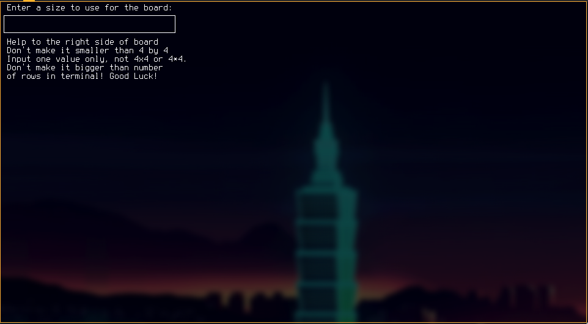
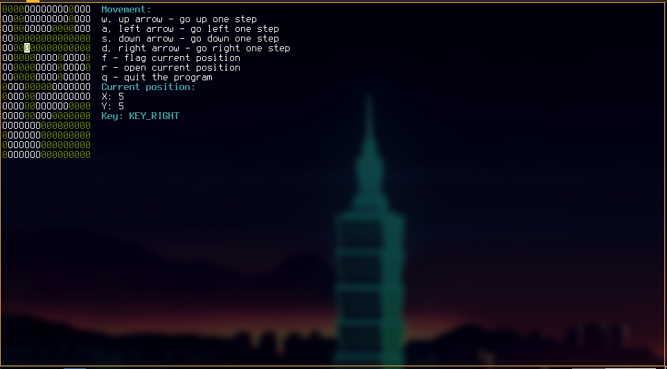
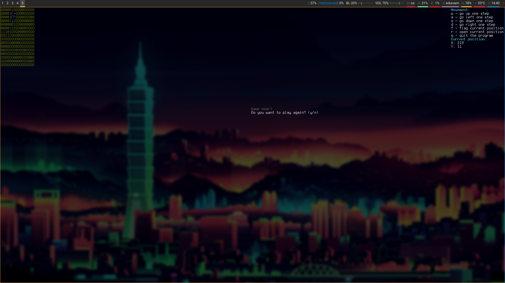
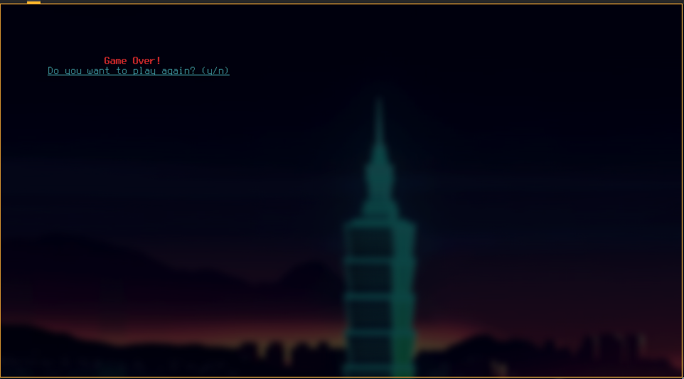

# Minesweeper
The game is not 100% complete, there is still stuff to fix, 
for example if you loose it should reveal where all the bombs where.
The game uses curses library in python to display everything.
How you move in the game and where you are currently at is displayed 
on the right side of the screen, while the game currently is on the 
left side of the screen. So for the moment the game is kinda off but
that will be fixed after I have come up with a way to calculate so
that the game is centered.<br>
<p>The game uses following keys to move around and do stuff</p>

Key | Action
----|-------------
w   | go up one step
a   | go left one step
s   | go down one step
d   | go right one step
f   | flag current position
r   | reveal current position
q   | quit the program

## On the way
- [ ] Fix better coloring of the program
- [ ] Implement a way to see if the user has won

### Coloring
From the beginning there were no colors used,
currently there are around 11 different color combinations used.
Current colors are:

Item | Color
-----|-------
O | White
0 | Blue
1 | Green
2 | Yellow
3 | Red
4 | Red
F | white f with red background

Curses have a limitation on colors so I have to mix them like ```curses.init_pair(10, curses.COLOR_RED + curses.COLOR_GREEN + curses.COLOR_MAGENTA, -1)```
where the color combination might make the text black with transparent background which is not so good.

## TODO
- [ ] Do something more
- [ ] Center the game and put help and other useful stuff to the right of the board

## Done
- [x] (Maybe) Accumulate score based on number in the current tile revealed.
- [x] Have a timer while the game is running
- [x] When loosing reveal all bombs in the game.

## Examples




